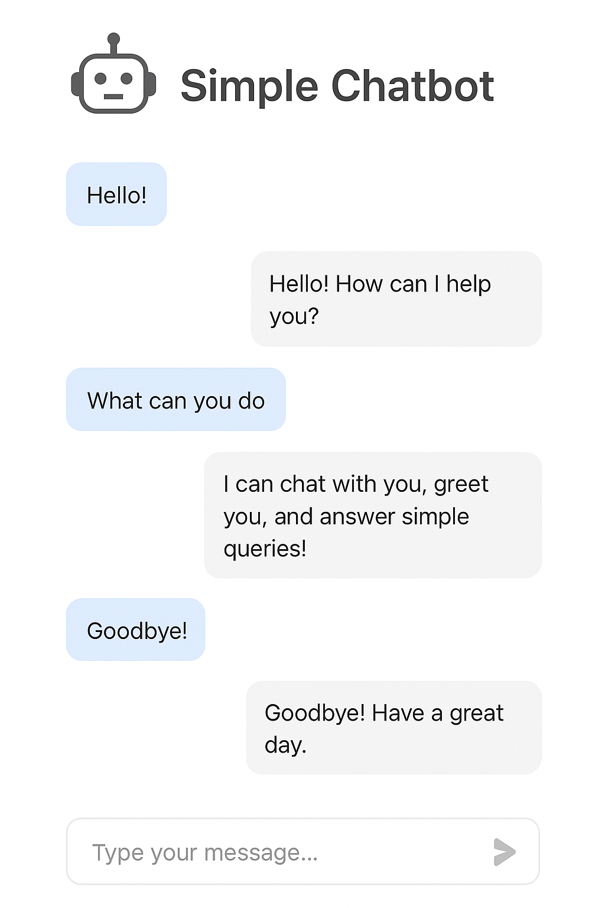

Simple GUI ChatBot

## Project Overview
This project is a simple graphical user interface (GUI) chatbot built in Python. It allows users to interact with a rule-based chatbot via a clean, scrollable GUI environment. The chatbot utilizes keyword matching to generate responses from a predefined dataset and delivers a user-friendly, real-time conversation experience.​
A beginner-friendly **Python Chatbot with a Tkinter GUI** chatbot built with Python and Tkinter that uses a JSON file for predefined responses.  
It provides a graphical chat interface, supports fuzzy matching for user inputs, and can be extended easily.
It uses `responses.json` for predefined answers and supports fuzzy matching.

## Features

GUI-based chat window for user interaction
Scrollable text area for conversation history
Entry box for user input and a send button
Keyword-matching logic with fuzzy matching for better response accuracy
Graceful program exit upon user commands like 'exit', 'quit', or 'bye'​

## Technologies/Tools Used

Python 3
Tkinter: For the GUI components
difflib.getclosematches: For basic natural language processing and fuzzy input matching
JSON: To load and parse response data from responses.json​

## Steps to Install & Run the Project

Make sure Python 3 is installed on your system.
Clone or download this repository.
Place a valid responses.json file (containing chatbot responses in JSON format) in the same directory as chatbot_gui.py.
Install any missing dependencies using pip (Tkinter is included with most standard Python installations).
Run the project from a terminal with:
text
python chatbot_gui.py
The chatbot window will launch for you to start chatting.​

## Instructions for Testing
Enter a message in the input field and click "Send" to interact with the bot.
Test both known and unknown phrases; the bot uses fuzzy matching and will reply with a fallback message if it does not understand.
Commands like 'exit', 'quit', or 'bye' will close the interface with a goodbye message.​
You may expand the responses.json file to improve and customize the chatbot’s response set.

## 📸 Preview

